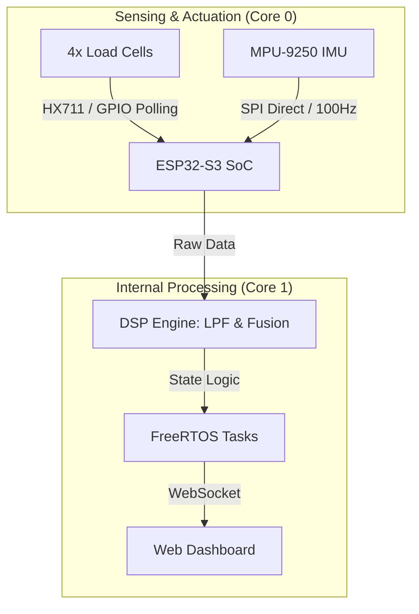

# Smart-Bed-IoT: Non-Invasive Health Monitoring System

**Smart-Bed-IoT** is a dual-MCU firmware implementation for a smart health monitoring bed. It utilizes a hybrid architecture combining **STM32** for high-precision sensor acquisition and **ESP32** for digital signal processing (DSP), IoT connectivity, and web hosting.

The system is designed to detect patient presence, determine sleeping posture, and monitor respiration rates without direct body contact, utilizing physics-based logic and signal analysis.

---

## System Architecture

The system integrates the entire signal acquisition and processing workflow into a single ESP32-S3 microcontroller to minimize latency and simplify the hardware design.



### Resource Allocation (Dual-Core Architecture)

| Core | Task | Description |
| --- | --- | --- |
| **Core 0** | **Sensor Acquisition** | Reads raw data from 4 Load Cells (HX711) and the MPU-9250 via SPI. Ensures precise timing for bit-banging protocols and high-frequency SPI communication. |
| **Core 1** | **DSP & Connectivity** | Executes noise filtering algorithms (Butterworth/EMA), calculates Respiration BPM, and manages Wi-Fi connections and the WebSocket Server. |

---

## Key Features

### 1. Presence Detection

* **Sensors:** 4x Load Cells (5kg capacity each).
* **Logic:** Aggregates the total weight from the four bed legs. The system automatically wakes up when a user is detected and enters a low-power deep sleep mode when the bed is empty.

### 2. Posture Classification

* **Algorithm:** Calculates the Center of Gravity (CoG) based on the differential pressure distribution across the four corners of the bed.
* **Classes:** Supine (Back), Left Lateral, Right Lateral.

### 3. Contactless Respiration Monitoring

* **Sensor:** MPU-9250 (Z-axis Accelerometer) placed under the pillow or mattress.
* **Signal Processing:**
1. **LPF (5Hz):** Removes electrical noise and high-frequency hardware vibrations.
2. **Baseline Removal:** Eliminates the static gravity component (DC Offset).
3. **Peak Detection:** Counts breathing cycles using a hysteresis-based peak detection algorithm to prevent false positives from noise.


* **Motion Rejection:** Automatically freezes the respiration counter when the Load Cells detect significant body movement.

### 4. Web Dashboard

* **Interface:** A Web Server hosted directly on the ESP32.
* **Visualization:** Real-time respiration waveform, BPM value, and posture status.
* **Protocol:** WebSocket (low latency).

---

## Hardware Configuration

### Pinout Mapping

The GPIO pins are defined in `app_config.h` for the ESP32-S3 DevKit:

| Device | ESP32 Pin | Function | Protocol |
| --- | --- | --- | --- |
| **MPU-9250** | GPIO 10 | CS | SPI |
|  | GPIO 11 | MOSI |  |
|  | GPIO 12 | SCLK |  |
|  | GPIO 13 | MISO |  |
| **LoadCell FL** | GPIO 1 / 2 | SCK / DT | Bit-banging |
| **LoadCell FR** | GPIO 42 / 41 | SCK / DT |  |
| **LoadCell BL** | GPIO 40 / 39 | SCK / DT |  |
| **LoadCell BR** | GPIO 38 / 37 | SCK / DT |  |

*(Note: Connect the GND of all sensors to the GND of the ESP32)*

---

## Software Structure

The project uses the **ESP-IDF** (Espressif IoT Development Framework).

```text
Smart-Bed-IoT/
├── src/
│   ├── main.c              # Application Entry Point & Task Scheduler
│   ├── drv_loadcell.c      # Optimized HX711 Driver
│   ├── drv_mpu.c           # MPU9250 SPI Driver
│   └── web_server.c        # Wi-Fi & WebSocket Implementation
├── include/
│   ├── app_config.h              # Pin Definitions & Constants
│   ├── drv_loadcell.h
│   ├── drv_mpu.h
├── CMakeLists.txt
└── README.md

```

---

## Installation & Build

### Prerequisites

1. **Hardware:** ESP32-S3 DevKit, MPU-9250, 4x Load Cells + HX711.
2. **Software:** VS Code with the Espressif IDF Extension.

### Setup Steps

1. **Clone the repository:**
```bash
git clone https://github.com/justargldude/Smart-Bed-IoT

```


2. **Configure Project:**
* Open the Command Palette in VS Code.
* Select `ESP-IDF: SDK Configuration Editor`.
* Configure the Flash size (4MB/8MB) and CPU Frequency (240MHz).


3. **Build & Flash:**
* Connect the ESP32-S3 via USB.
* Click **Build, Flash and Monitor** in VS Code.


4. **Visualize Data:**
* Raw data in the format `Accel_X, Accel_Y, Accel_Z` is printed to the UART/Terminal.
* Connect to the Wi-Fi Access Point created by the ESP32 to view the Web Dashboard.


---

## Disclaimer

* **Power Supply:** The ESP32-S3 consumes significant current when Wi-Fi is active. Ensure a stable power supply (>500mA) is used to prevent voltage drops that could affect ADC readings.
* **Safety:** This project is a research prototype intended for educational purposes only. It is not a certified medical device and should not be used as a replacement for professional medical equipment for diagnosis or patient monitoring.

## Author

**Thanh Tung Bui** - [buitung161@gmail.com](mailto:buitung161@gmail.com)
